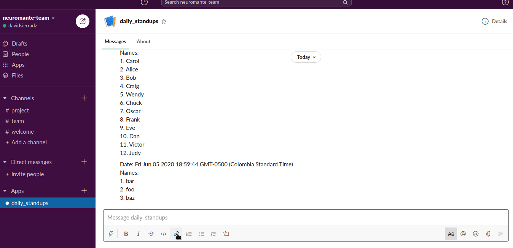

# Slack Bot Shuffle

This is a Node.js app built with [slackapi/bolt-js: A framework to build Slack apps using JavaScript](https://github.com/slackapi/bolt-js) that process a Slack command like `/daily x y z` to shuffle `x y z` into a random list:



## Requirements

First, you need to create a [Slack App](https://api.slack.com/apps?new_app=1), configure a *bot* and a *slash command* and get a **Signing Secret** and a **Bot User OAuth Access Token**.

Copy or rename `.env.example` to `.env` and put this tokens in it, like:

```env
SLACK_SIGNING_SECRET=XXXXXXXXXXXXXXXXXXXXXXXXXXXXXXXX
SLACK_BOT_TOKEN=XXXX-XXXXXXXXXXXXX-XXXXXXXXXXXXX-XXXXXXXXXXXXXXXXXXXXXXXX
PORT=3000
TZ=America/Bogota
```

Also, optionally configure the exposed port (`PORT`) and the Timezone you want the app responding (`TZ`).

Don't forget to install your bot in some Slack workspace.

## Start

If you have Node.js and yarn, just:

```sh
$ yarn install
> ...

$ yarn serve
> ⚡️ Bolt app is running!
```

If you don't have (or don't want to use) Node.js and/or yarn, there is a `Dockerfile` to build a container with the app ready to run:

```sh
# First build the image:
$ docker build --tag slackbot:local .
> Sending build context to Docker daemon  80.38kB
> ...

# Start a container:
$ docker run --rm --init --name 'slackbot' --env-file .env --publish '127.0.0.1:3000:3000' slackbot:local
> ⚡️ Bolt app is running!
```

## Development

Slack slash commands needs some URL to send the request, if you don't want to configure a server with a public IP, then use [ngrok - secure introspectable tunnels to localhost](https://ngrok.com/) to generate a public URL and expose your local instance of the server running:

```sh
# Start the app with hot reloading (Nodemon):
$ yarn start
> yarn run v1.22.4
> $ nodemon .
> ...

# If using port 3000:
$ ngrok http 3000
> ...
```

## License

MIT
